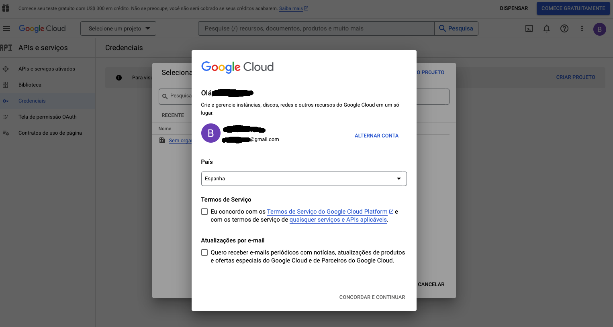
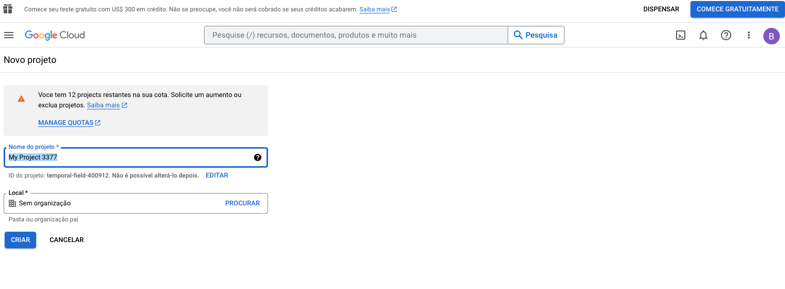
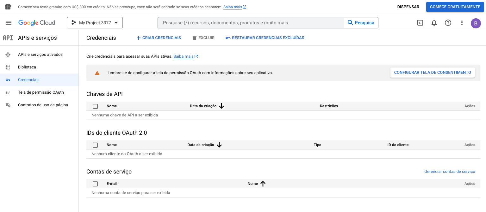
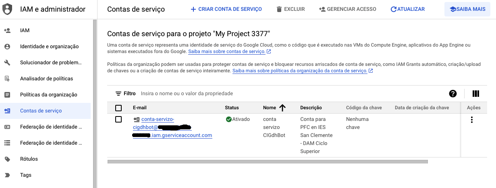
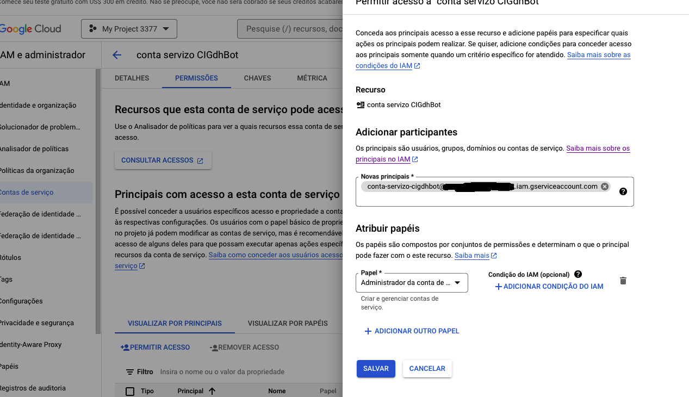
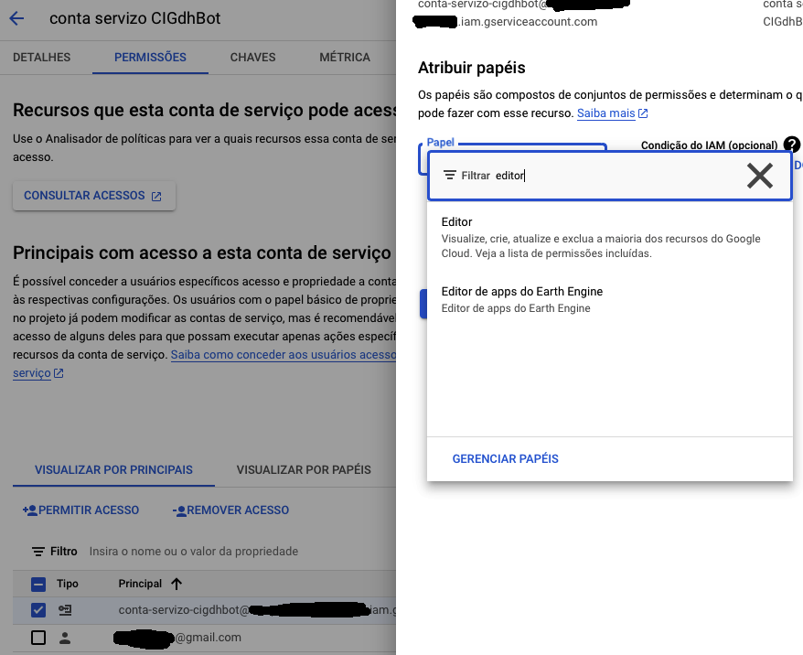
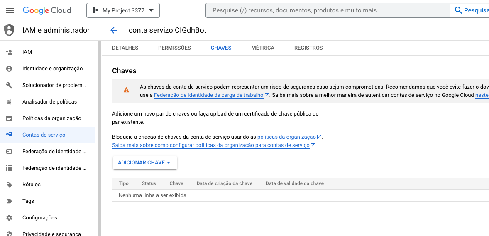
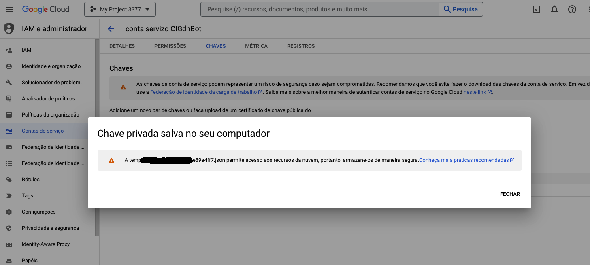
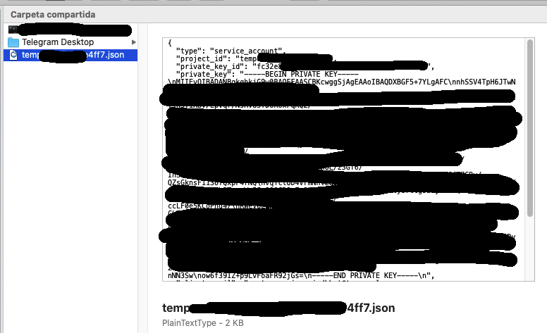

# Crear conta de servizo en GCP

Para empregar de *backend* Google Cloud Platform (GCP) no *CIGdhBot*, cómpre identificarse empregando algún dos xeitos que provee a plataforma de Google.

O máis doado, mantendo un balance axeitado entre comodidade e seguridade, é empregar unha **conta de servizo** que teña acceso aos ficheiros e directorios do Google Drive que empreguemos.

A continuación describo, máis ou menos pormenorizadamente, o proceso de creación desta e da chave privada a empregar como autenticación para poder acceder aos recursos compartidos por esta conta de servizo.

1. Imos á URL [https://console.cloud.google.com/apis/credentials](https://console.cloud.google.com/apis/credentials)
2. Se non estamos dados de alta, forzarásenos a darnos de alta en Google Cloud.

3. Damos de alta o proxecto xenérico

4. Damos de alta a conta de servizo

5. Conta de servizo creada

6. Engadimos permisos de *Editor* á conta

7. Conta de servizo creada

8. Agora creamos a chave privada para autenticarnos na conta de servizo

9. De tipo JSON

10. Chave privada creada

11. Descarga no noso equipo

     
 
