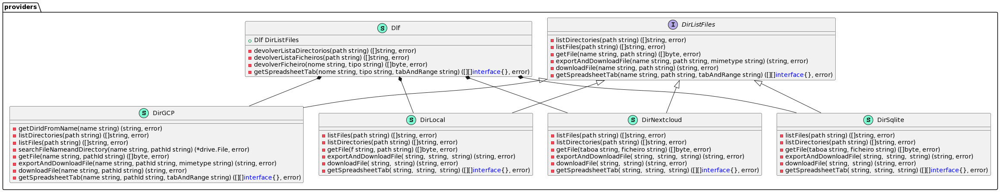
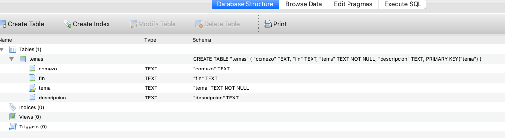
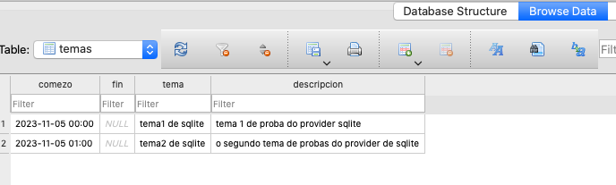

# Estructura de package *providers*

O paquete *providers* da acceso a unha serie de *proveedores* que permitirían empregar como *backend* dos datos a consumir varios tipos de xestionadores da información, sempre que cumpran coa *interface* ***DirListFiles***, por exemplo:

- proveedores de cloud (ver [*providers/gcp.go*](../../src/providers/gcp.go))
- servidores específicos, como por exemplo Nextcloud (ver [*providers/nextcloud.go*](../../src/providers/nextcloud.go))
- un sistema de ficheiros local (ver [*providers/localfilesystem.go*](../../src/providers/localfilesystem.go))
- outros, tales como unha BD (ver [*providers/sqlite.go*](../../src/providers/sqlite.go))


### UML package providers




### Interfaz DirListFiles

Debe ser cumplida por todos os *providers*, aínda que despois o corpo de cada método non sexa funcional.


```go
	listDirectories(path string) ([]string, error)                                           // lista directorios colgando do diretorio que se lhe pase (nom recursivo)
	listFiles(path string) ([]string, error)                                                 // lista ficheiros do diretorio pasado
	getFile(name string, path string) ([]byte, error)                                        // devolve []byte do ficheiro pasado, por (nome, carpeta da que colga). O nome e parte do nome do ficheiro, nom enteiro (em GCP)
	exportAndDownloadFile(name string, path string, mimetype string) (string, error)         // para GCP: devolve ruta absoluta dum ficheiro, exportandoo previamente antes da descarga
	downloadFile(name string, path string) (string, error)                                   // para GCP: descarga e devolve ruta absoluta do ficheiro temporal descargado
	getSpreadsheetTab(name string, path string, tabAndRange string) ([][]interface{}, error) // lectura dumha spreadsheet. tabAndRange, formato de sheets (tab!A1:E10)
```

### localfilesystem

Proveedor que emprega un sistema de ficheiros locais. Polo de agora só se implementan *listFiles()*, *listDirectories()* e o método *getFile()* para demostración.

Para testealo, o test do paquete *temas* engade un test, *TestMenuTemasLocal*, que emprega especificamente este backend:

```go
alex@vosjod:~/Development/CIGdinahostingBot/src/temas(master)$ go test -test.v --run ^TestMenuTemasLocal$
=== RUN   TestMenuTemasLocal
b: [este
é
un
simple
ficheiro de texto
cos temas
en
local.
]--- PASS: TestMenuTemasLocal (0.00s)
PASS
ok  	github.com/alexandregz/CIGdinahostingBot/src/temas	0.998s
```


### sqlite

No ficheiro [*providers/sqlite.go*](../../src/providers/sqlite.go) pódese ver un exemplo de implementar un *provider* que emprega unha BD, neste caso un ficheiro sqlite no path *src/providers/backend_sqlite.sqlite*.







Para testealo, o test do paquete *temas* engade un test, *TestMenuTemasSqlite*, que emprega este backend:

```bash
alex@vosjod:~/Development/CIGdinahostingBot/src/temas(master)$ go test -test.v --run ^TestMenuTemasSqlite$
=== RUN   TestMenuTemasSqlite
b: [{2023-11-05 00:00 %!s(bool=true)}|{ %!s(bool=false)}|tema1 de sqlite|{tema 1 de proba do provider sqlite %!s(bool=true)}
{2023-11-05 01:00 %!s(bool=true)}|{ %!s(bool=false)}|tema2 de sqlite|{o segundo tema de probas do provider de sqlite %!s(bool=true)}
]--- PASS: TestMenuTemasSqlite (0.00s)
PASS
ok  	github.com/alexandregz/CIGdinahostingBot/src/temas	0.841s
```

No método ***getFile(taboa string, ficheiro string)*** faise a conexión cun ficheiro .sqlite de probas. recollense certos datos de exemplo dunha táboa *temas* e devolvese un array de bytes que contén os datos da táboa.


### nextcloud

Proveedor que emprega como backend un Nextcloud, utilizando a API deste para acceder aos ficheiros contidos no server mediante usuario autorizado.

Para testealo, o test do paquete *providers* engade dous tests, *TestGetListDirectoriesNextcloud* e *TestGetListFilesNextcloud*, que empregan este tipo de servidor:

```go
alex@vosjod:~/Development/CIGdinahostingBot/src/providers(master)$ go test -test.v --run Nextcloud
=== RUN   TestGetListDirectoriesNextcloud
--- PASS: TestGetListDirectoriesNextcloud (2.56s)
=== RUN   TestGetListFilesNextcloud
--- PASS: TestGetListFilesNextcloud (2.50s)
PASS
ok  	github.com/alexandregz/CIGdinahostingBot/src/providers	6.073s
```

### gcp

Provider que se emprega de xeito *real*.

No método *init()* carga as credencias para empregar a API de Google Drive e a de Google Sheets, a través do ficheiro de credenciais da conta de servizo, cuxo path exportamos a través do entorno por seguridade.

Ao ter un uso intensivo, a estructura *DirGCP*, que hereda da estructura *Dlf* para implementar a interfaz *DirListFiles*, implementa algúna método máis que só os indicados pola interfaz, por exemplo *searchFileNameandDirectory()*.

Por eficiencia, nos métodos que implican descarga, como *downloadFile()* e *exportAndDownloadFile()*, compróbase previamente se o ficheiro xa está descargado, para non volver a descargar o ficheiro se xa o temos no directorio onde go deixa os ficheiros temporais (comentario `// buscamos se o ficheiro esta ja descargado, ou exportado ou o orixinal`)


Para testealo, o test do paquete *temas* engade dous test, *TestMenuTemasGCP* (contra un .txt online) e *TestMenuTemasGCPxlsx* (contra un xlsx de Google Drive), que empregan especificamente este tipo de backend:

```go
alex@vosjod:~/Development/CIGdinahostingBot/src/temas(master)$ go test -test.v --run ^TestMenuTemasGCP
=== RUN   TestMenuTemasGCP
str: [tema1
tema2
e
tema4]--- PASS: TestMenuTemasGCP (1.71s)
=== RUN   TestMenuTemasGCPxlsx
b: [[][]interface {}{[]interface {}{"Data comezo", "Data fin", "Tema", "Descripcion"}, []interface {}{"", "", "revisar xx xx 2022", "Dixo Ester de Igualdade da CIG que xxx."}, []interface {}{"", "2023-04-21", "", "Postura a tomar diante dos contratos xxx: agardamos a nova contratación em soporte, a ver xxx."}, []interface {}{"", "", "reunións previas ao comité", "realizar reunións previas entre a sección sindical previas á reunión do comité de empresa"}, []interface {}{"", "2023-05-01", "cláusula proibidos xxx xxxx", "para o CSS, realizar cláusula para proibir xxxxxx, que se engada ao Protocolo de Desconexión dixital"}}]--- PASS: TestMenuTemasGCPxlsx (1.61s)
PASS
ok  	github.com/alexandregz/CIGdinahostingBot/src/temas	4.228s
```

